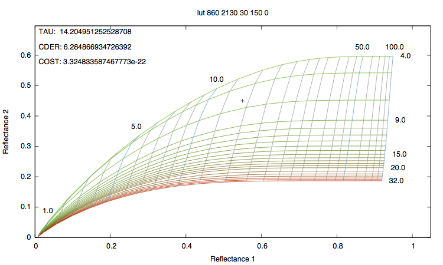

MICO-RE
===
MICO-RE 【miko-li】  
Minimal Implementation of Cloud Optical Retrieval

MICO-RE estimates cloud optical thickness (COT) and
cloud droplet effective radius (CDER) from reflectances in two wavelengths
by using look-up table (Nakajima and King, 1990) and Gauss-Newton method (Rodgers, 2000).  
Akima method (Akima, 1970) is used as a method of interpolation.


Cloud Optical Retrieval Code
---

### Installation

Just execute `make` command in `src` directory.

    $ cd src
    $ make

You can change your compiler setting in the `Makefile` (The default compiler is `gfortran`).

### Usage

    $ ./micore [lutfile] [reflectance1] [reflectance2]

like following:

    $ ./micore ../example/lut_860_2130.bin 0.553 0.343

If you enable the verbose flag (please read the part of tuning),
the output is composed by:

* observed reflectances,
* loaded LUT,
* for each iterate step,
    - estimated cloud parameters,
    - estimated reflectances,
    - cost,
* final cloud parameters and cost.

Final cloud parameters and cost are printed like:

```
 TAU:     13.206873367078288
 CDER:    6.2165327975806086
 COST:    1.1572150238204060E-020
```


Look-up table
---
Look-up table used in this program should be like following:

ex.)

| COT | CDER | REF1 | REF2 |
|:----|:-----|:-----|:-----|
| 1.0 | 3.0  | 0.20 | 0.10 |
| 1.0 | 5.0  | 0.20 | 0.13 |
| 1.0 | 7.0  | 0.21 | 0.15 |
| 1.0 | 9.0  | 0.23 | 0.14 |
| ... | ...  | ...  | ...  |
| ... | ...  | ...  | ...  |
| 2.0 | 3.0  | 0.26 | 0.14 |
| 2.0 | 5.0  | 0.26 | 0.18 |
| 2.0 | 7.0  | 0.27 | 0.19 |
| 2.0 | 9.0  | 0.29 | 0.18 |
| ... | ...  | ...  | ...  |
| ... | ...  | ...  | ...  |


This file should be given as a binary format.  
The data should be sorted like above.

An example of LUT is `example/lut_860_2130.bin` (SZA:30deg, VZA:30deg, RAA:0deg).

You can see the details by a command:

    $ od -f example/lut_860_2130.bin | less

LUT should be calculated by radiative transfer models (ex. RSTAR).


Utils
---

* lut\_plot.rb
* micore\_tester.rb

`lut_plot.rb` makes a Nakajima-King-like plot of the look-up table.

    $ ruby lut_plot.rb ../../example/lut_860_2130.bin only_lut.png
    $ ruby lut_plot.rb ../../example/lut_860_2130.bin with_point.png 0.55 0.45

It makes a plot like following:



`micore_tester.rb` makes a 2D histogram which represents
differences between true and estimated cloud properties like following:


Tuning
---

There are some technical parameters in the header of `micore_core.f90`.

``` fortran
  ! flag for verbose mode
  logical, parameter :: verbose_flag = .true.

  ! threshold value for convergence of cost function
  real(R_), parameter :: threshold = 1e-13_R_
  real(R_), parameter :: diff_thre = 1e-13_R_
  ! max # of iteration
  integer, parameter :: max_iter = 9999
  ! max and min of tau and cder
  real(R_), parameter :: tau_max  = 150.0_R_
  real(R_), parameter :: tau_min  = 0.3_R_
  real(R_), parameter :: cder_max = 35.0_R_
  real(R_), parameter :: cder_min = 1.0_R_
```

You can modify these parameters as you like before compiling.


References
---

* [Teruyuki Nakajima and Michael D. King, 1990: Determination of the Optical Thickness and Effective Particle Radius of Clouds from Reflected Solar Radiation Measurements. Part I: Theory. J. Atmos. Sci., 47, 1878–1893.](http://journals.ametsoc.org/doi/abs/10.1175/1520-0469(1990)047%3C1878%3ADOTOTA%3E2.0.CO%3B2)
* [Rodgers, C. D., 2000: Inverse Methods for Atmospheric Sounding-Theory and Practice.](http://www.worldscientific.com/worldscibooks/10.1142/3171)
* [Hiroshi Akima, 1970: A new method of interpolation and smooth curve fitting based on local procedures. JACM, 17.4, 589–602.](http://dl.acm.org/citation.cfm?id=321609)

